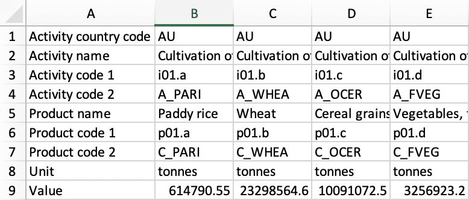

# mrio_common_metadata

`mrio_common_metadata` provides two things:

* A [Data Package](https://frictionlessdata.io/specs/data-package/) specification and implementation of the specification for common MRIO tables
* Utility functions to provide python generators to return row and column metadata, and (non-zero) data.

# Processed data

Some MRIO tables are provided in weird formats or behind registration walls, but are provided with open licenses. In this case, this tables have been converted to compressed CSVs and made available for direct download. All code used in processing data can be found in `mrio_common_metadata/processing`.

Please don't abuse these downloads, as I have to pay for the bandwidth myself!

# Data generators

`mrio_common_metadata.get_data_iterator`

# `labeled-offset-table` profile

The `labeled-offset-table` is a Data Package [Profile](https://frictionlessdata.io/specs/profiles/) for tables with data and labels, where the data and labels are not easily identifiable. For example, the column labels may be given as rows instead of columns, or various label or data offsets may be difficult to determine automatically. The approach of `mrio_common_metadata` is quite simple: The profile requires explicit labelling of all offset and label fields. Here is an example worksheet:

This worksheet would have the following schema:

**Note**: The `labeled-offset-table` uses [0-based indexing](https://en.wikipedia.org/wiki/Zero-based_numbering)!

    "schema": {
      "rows": {
        "internal": true,
        "col-offset": 1,
        "name": "activities",
        "fields": [{
          "label": "country code",
          "row-index": 0,
        }, {
          "label": "name",
          "row-index": 1,
        }, {
          "label": "code 1",
          "row-index": 2,
        }, {
          "label": "code 2",
          "row-index": 3,
        }]
      },
      "cols": {
        "internal": true,
        "axis": "row",
        "row-offset": 4,
        "col-offset": 1,
        "name": "activities",
        "fields": [{
          "label": "country code",
          "row-index": 0,
        }, {
          "label": "name",
          "row-index": 4,
        }, {
          "label": "code 1",
          "row-index": 5,
        }, {
          "label": "code 2",
          "row-index": 6,
        }, {
          "label": "unit",
          "row-index": 7,
        }]
      },
      "data": {
        "row-offset": 8,
        "col-offset": 1,
        "type": "quantitative",
        "sentries": [614790.55, 614790.55, 5306.091197, 0]
      }
    }

Import the [EXIOBASE](https://exiobase.eu/) database into Brightway (version 3).

Currently only works with version 3.3.17, Hybrid Input-Output tables. See details on matching [EXIOBASE to Ecoinvent biosphere flows](https://github.com/brightway-lca/bw_migrations/blob/master/bw_migrations/data/exiobase-3-ecoinvent-3.6.json#L634) here.

Usage:

Download EXIOBASE ([version 3.3.17 HSUT 2011](https://exiobase.eu/index.php/data-download/exiobase3hyb)).

Install `bw_exiobase` using [conda](https://docs.conda.io/en/latest/miniconda.html):

    conda install -c conda-forge -c cmutel -c cmutel/label/nightly -c haasad bw_exiobase

Then, run the following in a Python shell or Jupyter notebook:

    import bw_default_backend as be
    import brightway_projects as p
    import brightway_ecoinvent_metadata
    from bw_exiobase import import_exiobase, convert_exiobase

    p.projects.create_project("exiobase", add_base_data=True)
    brightway_ecoinvent_metadata.add_ecoinvent_metadata()
    import_exiobase()
